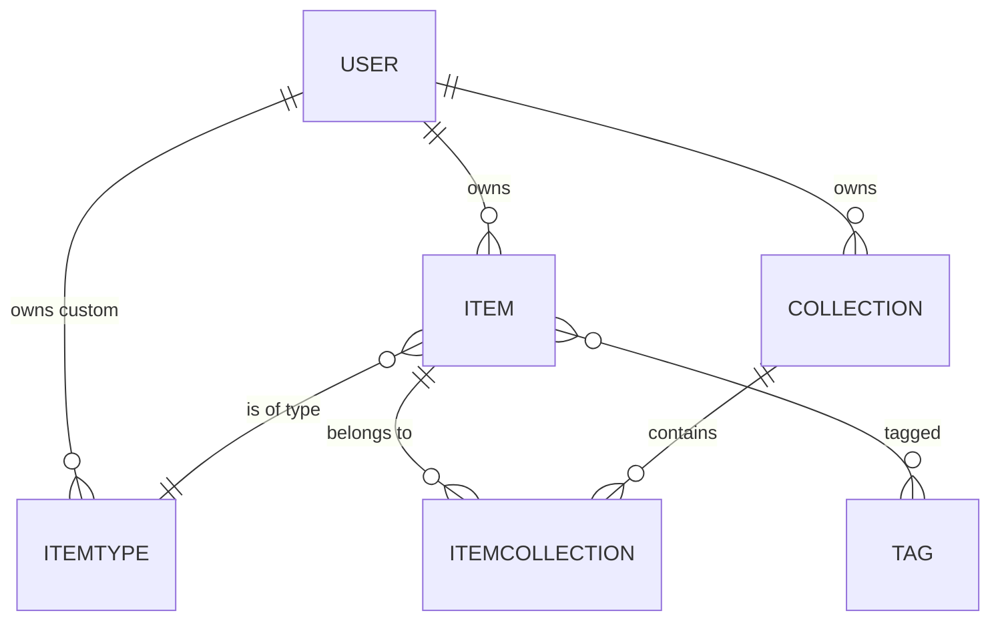

# 📦 DevSnip — Project Overview

> One fast, searchable, AI-enhanced hub for all developer knowledge and resources.

---

## 🎯 Problem

Developers keep their essentials scattered across too many places:

- 📝 Code snippets in VS Code or Notion
- 🤖 AI prompts in random chat histories
- 📁 Context files buried deep in projects
- 🔖 Useful links in browser bookmarks
- 📚 Docs in random folders
- ⌨️ Commands in `.txt` files
- 🧩 Project templates in GitHub gists
- 💻 Terminal commands lost in bash history

This creates **context switching**, **lost knowledge**, and **inconsistent workflows**.

**DevSnip** solves this by providing a single, fast, searchable, AI-enhanced hub for all dev knowledge and resources.

---

## 🧭 Product Overview

DevSnip is a **developer-first knowledge vault**: a Notion-for-devs crossed with Raycast's speed and Linear's aesthetic. It lives in the browser (Next.js web app) and is optimized for the moment between "I need that thing I saved" and "I've pasted it into my editor" — ideally under two seconds.

### Core Principles

| Principle | What It Means in Practice |
|-----------|---------------------------|
| ⚡ **Speed first** | Drawer-based UI, optimistic updates, keyboard shortcuts, cached reads |
| 🗂️ **Organize your way** | Flexible types + collections + tags — items can live in many places at once |
| 🔍 **Find it fast** | Full-text search across content, titles, tags, and types |
| 🤖 **AI where it earns its keep** | Tagging, summaries, explanations, prompt optimization — never gimmicks |
| 🌙 **Built for dev eyes** | Dark mode default, syntax highlighting, monospace where it belongs |
| 🔐 **Your data is yours** | Export anytime, own your account, no lock-in |

### Core Journeys

1. **Capture** → hit `⌘K`, paste content, auto-detect type, save to a collection.
2. **Find** → search by content / tag / type, or browse collections visually.
3. **Use** → open the item drawer, one-click copy, close — never lose flow.
4. **Enhance (Pro)** → let AI tag, summarize, explain, or optimize on demand.

### Success Metrics (North Stars)

- ⏱️ **Time-to-paste** under 2s from intent to clipboard
- 📈 **Items created per active user per week** (stickiness)
- 🔁 **Return frequency** (daily active / weekly active)
- 💎 **Free → Pro conversion** at the 50-item / 3-collection ceiling

---

## 👥 Target Users

| User | Needs |
|------|-------|
| 🧑‍💻 **Everyday Developer** | Fast way to grab snippets, prompts, commands, and links |
| 🤖 **AI-first Developer** | Saves prompts, contexts, workflows, and system messages |
| 🎓 **Content Creator / Educator** | Stores code blocks, explanations, and course notes |
| 🏗️ **Full-stack Builder** | Collects patterns, boilerplates, and API examples |

---

## ✨ Features

### A. Items & Item Types

Items are the core unit of DevSnip. Every item has a **type**. Users will eventually be able to create custom types, but we ship with these **system types** (non-editable):

| Type | Category | Free Tier? |
|------|----------|------------|
| `snippet` | text | ✅ |
| `prompt` | text | ✅ |
| `note` | text | ✅ |
| `command` | text | ✅ |
| `link` | url | ✅ |
| `file` | file | 🔒 Pro only |
| `image` | file | 🔒 Pro only |

**Item categories:**
- **text** → snippet, prompt, note, command
- **url** → link
- **file** → file, image

**URL structure:** `/items/snippets`, `/items/prompts`, etc.

Items should be quick to **access** and **create** within a drawer.

---

### B. Collections

Users can create collections that can hold items of **any** type. An item can belong to **multiple** collections simultaneously.

**Examples:**
- _React Patterns_ (snippets, notes)
- _Context Files_ (files)
- _Python Snippets_ (snippets)
- _Interview Prep_ (snippets, notes, links)

A React snippet could live in both _React Patterns_ **and** _Interview Prep_.

---

### C. Search

Powerful search across:

- Item **content**
- **Tags**
- **Titles**
- **Types**

---

### D. Authentication

- Email / password
- GitHub OAuth

Powered by **NextAuth v5**.

---

### E. Other Features

- ⭐ Favorites for collections and items
- 📌 Pin items to top
- 🕐 Recently used
- 📥 Import code from a file
- ✍️ Markdown editor for text types
- 📤 File upload for file types (file/image)
- 💾 Export data in multiple formats
- 🌙 Dark mode by default
- ➕➖ Add/remove items to/from multiple collections
- 🔗 View which collections an item belongs to

---

### F. 🔒 AI Features (Pro only)

- 🏷️ AI auto-tag suggestions
- 📝 AI summaries
- 💡 AI "Explain This Code"
- ✨ Prompt optimizer

---

## 🗺️ Data Model

High-level entity relationship:



### Prisma Schema (draft)

> ⚠️ **Note:** Rough mockup — not set in stone. Refine during implementation.

```prisma
// ──────────────────────────────────────────────────────────────
// USER (extends NextAuth base User)
// ──────────────────────────────────────────────────────────────
model User {
  id                   String   @id @default(cuid())
  email                String   @unique
  name                 String?
  image                String?

  // Monetization
  isPro                Boolean  @default(false)
  stripeCustomerId     String?  @unique
  stripeSubscriptionId String?  @unique

  // Relations
  items        Item[]
  collections  Collection[]
  itemTypes    ItemType[]   // custom user-created types
  accounts     Account[]    // NextAuth
  sessions     Session[]    // NextAuth

  createdAt    DateTime @default(now())
  updatedAt    DateTime @updatedAt
}

// ──────────────────────────────────────────────────────────────
// ITEM — the core unit
// ──────────────────────────────────────────────────────────────
model Item {
  id          String   @id @default(cuid())
  title       String
  description String?

  // Content
  contentType String   // "text" | "file"
  content     String?  @db.Text   // text content (null if file)
  fileUrl     String?               // R2 URL (null if text)
  fileName    String?
  fileSize    Int?                  // bytes
  url         String?               // for link types
  language    String?               // optional code language

  // Meta
  isFavorite  Boolean  @default(false)
  isPinned    Boolean  @default(false)

  // Relations
  userId      String
  user        User     @relation(fields: [userId], references: [id], onDelete: Cascade)

  itemTypeId  String
  itemType    ItemType @relation(fields: [itemTypeId], references: [id])

  collections ItemCollection[]
  tags        Tag[]

  createdAt   DateTime @default(now())
  updatedAt   DateTime @updatedAt

  @@index([userId])
  @@index([itemTypeId])
}

// ──────────────────────────────────────────────────────────────
// ITEMTYPE — system + custom types
// ──────────────────────────────────────────────────────────────
model ItemType {
  id       String  @id @default(cuid())
  name     String
  icon     String
  color    String
  isSystem Boolean @default(false)

  // userId is null for system types
  userId   String?
  user     User?   @relation(fields: [userId], references: [id], onDelete: Cascade)

  items    Item[]

  @@unique([userId, name])
}

// ──────────────────────────────────────────────────────────────
// COLLECTION
// ──────────────────────────────────────────────────────────────
model Collection {
  id            String   @id @default(cuid())
  name          String
  description   String?
  isFavorite    Boolean  @default(false)
  defaultTypeId String?  // default type for new items when empty

  userId        String
  user          User     @relation(fields: [userId], references: [id], onDelete: Cascade)

  items         ItemCollection[]

  createdAt     DateTime @default(now())
  updatedAt     DateTime @updatedAt

  @@index([userId])
}

// ──────────────────────────────────────────────────────────────
// ITEMCOLLECTION — join table with metadata
// ──────────────────────────────────────────────────────────────
model ItemCollection {
  itemId       String
  collectionId String
  addedAt      DateTime @default(now())

  item         Item       @relation(fields: [itemId], references: [id], onDelete: Cascade)
  collection   Collection @relation(fields: [collectionId], references: [id], onDelete: Cascade)

  @@id([itemId, collectionId])
  @@index([collectionId])
}

// ──────────────────────────────────────────────────────────────
// TAG
// ──────────────────────────────────────────────────────────────
model Tag {
  id    String @id @default(cuid())
  name  String @unique
  items Item[]
}
```

---

## 🛠️ Tech Stack

### Framework & Language
- **Next.js 16** / **React 19**
- SSR pages with dynamic components
- API routes for backend (items, file uploads, AI calls)
- Single codebase / monorepo for less overhead
- **TypeScript** for type safety

### Database & ORM
- **Neon** (cloud PostgreSQL)
- **Prisma 7** ORM → [Prisma Docs](https://www.prisma.io/docs)
- **Redis** for caching _(maybe — evaluate later)_

> ⚠️ **IMPORTANT:** Never use `prisma db push` or modify DB structure directly. Always create **migrations** — run in dev, then prod.

### File Storage
- **Cloudflare R2** for file/image uploads → [R2 Docs](https://developers.cloudflare.com/r2/)

### Authentication
- **NextAuth v5** → [NextAuth Docs](https://authjs.dev/)
- Email/password
- GitHub OAuth

### AI Integration
- **OpenAI** — `gpt-5-nano` model → [OpenAI API Docs](https://platform.openai.com/docs)

### Styling
- **Tailwind CSS v4** → [Tailwind Docs](https://tailwindcss.com/docs)
- **shadcn/ui** components → [shadcn Docs](https://ui.shadcn.com/)

---

## 💰 Monetization (Freemium)

### 🆓 Free Tier
- 50 items total
- 3 collections
- All system types **except** files/images
- Basic search
- ❌ No file/image uploads
- ❌ No AI features

### 💎 Pro Tier — **$8/mo** or **$72/year** (save ~25%)
- ♾️ Unlimited items
- ♾️ Unlimited collections
- 📁 File & image uploads
- 🎨 Custom types _(coming later)_
- 🤖 AI auto-tagging
- 💡 AI code explanation
- ✨ AI prompt optimizer
- 📤 Export data (JSON / ZIP)
- 🎯 Priority support

> 🚧 **During development:** scaffold the Pro infrastructure, but all users get full access until launch.

---

## 🎨 UI/UX

### General Principles
- Modern, minimal, developer-focused
- **Dark mode by default**, light mode optional
- Clean typography, generous whitespace
- Subtle borders and shadows
- Syntax highlighting for code blocks
- **Reference aesthetics:** Notion, Linear, Raycast

### Layout

```
┌─────────────┬─────────────────────────────────────────────┐
│             │                                             │
│   Sidebar   │              Main Content                   │
│             │                                             │
│  • Types    │   ┌──────────┐  ┌──────────┐  ┌──────────┐  │
│  • Snippets │   │Collection│  │Collection│  │Collection│  │
│  • Prompts  │   │  Card    │  │  Card    │  │  Card    │  │
│  • Notes    │   └──────────┘  └──────────┘  └──────────┘  │
│  • Commands │                                             │
│  • Links    │   ┌────┐ ┌────┐ ┌────┐ ┌────┐ ┌────┐       │
│             │   │Item│ │Item│ │Item│ │Item│ │Item│       │
│ Recent      │   └────┘ └────┘ └────┘ └────┘ └────┘       │
│ Collections │                                             │
│             │          [ Item Drawer slides in → ]        │
└─────────────┴─────────────────────────────────────────────┘
```

- **Sidebar:** Item types (links to `/items/snippets`, etc.) + latest collections. Collapsible.
- **Main:** Grid of **color-coded collection cards** (background color based on most-held item type). Items display under collections as color-coded cards (border color).
- **Item drawer:** Individual items open in a quick-access drawer (not a full page).

### Responsive
- Desktop-first, mobile usable
- Sidebar collapses into drawer on mobile

### Micro-interactions
- Smooth transitions
- Hover states on cards
- Toast notifications for actions
- Loading skeletons

### Design System
See **`design-system.md`** — Framer-inspired dark aesthetic with pure black canvas, GT Walsheim display type, and Framer Blue (`#0099ff`) as the sole accent.

---

## 🏗️ Architecture Overview

```
┌────────────────────────────────────────────────────────────────┐
│                         Browser (Client)                       │
│   React 19 · Next.js 16 App Router · Tailwind v4 · shadcn/ui   │
└────────────────────────────────────────────────────────────────┘
                    │                         │
         (Server Actions)              (API Routes)
                    │                         │
┌────────────────────────────────────────────────────────────────┐
│                       Next.js Server                           │
│   ┌──────────────┐  ┌──────────────┐  ┌──────────────────┐     │
│   │  NextAuth v5 │  │  Rate Limit  │  │  Middleware      │     │
│   │  (auth.ts)   │  │  (optional)  │  │  (auth guard)    │     │
│   └──────────────┘  └──────────────┘  └──────────────────┘     │
│   ┌──────────────┐  ┌──────────────┐  ┌──────────────────┐     │
│   │  Prisma ORM  │  │  OpenAI SDK  │  │  R2 S3 Client    │     │
│   └──────────────┘  └──────────────┘  └──────────────────┘     │
└────────────────────────────────────────────────────────────────┘
        │                    │                       │
        ▼                    ▼                       ▼
 ┌─────────────┐    ┌─────────────────┐    ┌─────────────────┐
 │    Neon     │    │  OpenAI API     │    │  Cloudflare R2  │
 │ (Postgres)  │    │  gpt-5-nano     │    │  (file storage) │
 └─────────────┘    └─────────────────┘    └─────────────────┘
        │
        ▼
 ┌─────────────┐
 │   Stripe    │  (webhooks for subscription state)
 └─────────────┘
```

### Data Flow — Creating an Item

```
User types in drawer → optimistic UI update → Server Action
  → auth check → plan-limit check → Prisma insert → revalidatePath
  → toast success → (if file) R2 presigned upload → update fileUrl
```

### Data Flow — AI Auto-Tag (Pro)

```
User clicks "Suggest Tags" → API route /api/ai/tags
  → auth + isPro check → OpenAI call (gpt-5-nano)
  → parse response → return tags → client attaches via mutation
```

---

## 📁 File & Folder Structure

Using Next.js 16 **App Router** conventions with route groups to separate marketing, auth, and app surfaces.

```
devsnip/
├── .env.example                      # Template for required env vars
├── .env.local                        # Local secrets (gitignored)
├── .eslintrc.json
├── .gitignore
├── .prettierrc
├── next.config.ts
├── package.json
├── tsconfig.json
├── tailwind.config.ts
├── postcss.config.mjs
├── middleware.ts                     # Auth guard, redirects
├── README.md
│
├── docs/
│   ├── project-overview.md           # This file
│   └── design-system.md              # Framer-inspired design spec
│
├── prisma/
│   ├── schema.prisma                 # Source of truth for DB schema
│   ├── migrations/                   # Version-controlled migrations
│   │   └── 20260418000000_init/
│   │       └── migration.sql
│   └── seed.ts                       # Seed system ItemTypes
│
├── public/
│   ├── fonts/                        # GT Walsheim, Inter, Azeret Mono
│   ├── icons/
│   └── og/                           # OG images for sharing
│
└── src/
    ├── app/
    │   ├── layout.tsx                # Root layout (theme, fonts, toaster)
    │   ├── page.tsx                  # Marketing landing page
    │   ├── globals.css               # Tailwind + design tokens
    │   ├── not-found.tsx
    │   ├── error.tsx
    │   │
    │   ├── (marketing)/              # Public pages — route group
    │   │   ├── pricing/
    │   │   ├── about/
    │   │   └── changelog/
    │   │
    │   ├── (auth)/                   # Auth flows — route group
    │   │   ├── login/page.tsx
    │   │   ├── register/page.tsx
    │   │   └── layout.tsx            # Centered auth shell
    │   │
    │   ├── (app)/                    # Authenticated app — route group
    │   │   ├── layout.tsx            # Sidebar + main shell
    │   │   ├── dashboard/page.tsx    # Collection grid home
    │   │   ├── items/
    │   │   │   ├── page.tsx          # All items
    │   │   │   └── [type]/page.tsx   # /items/snippets, /items/prompts, etc.
    │   │   ├── collections/
    │   │   │   ├── page.tsx
    │   │   │   └── [id]/page.tsx
    │   │   ├── search/page.tsx
    │   │   ├── favorites/page.tsx
    │   │   ├── recent/page.tsx
    │   │   └── settings/
    │   │       ├── page.tsx          # Profile
    │   │       ├── billing/page.tsx  # Stripe portal
    │   │       ├── account/page.tsx
    │   │       └── export/page.tsx   # Pro data export
    │   │
    │   └── api/                      # Route handlers
    │       ├── auth/[...nextauth]/route.ts
    │       ├── items/
    │       │   ├── route.ts          # GET list, POST create
    │       │   └── [id]/route.ts     # GET, PATCH, DELETE
    │       ├── collections/
    │       │   ├── route.ts
    │       │   └── [id]/route.ts
    │       ├── tags/route.ts
    │       ├── search/route.ts
    │       ├── upload/
    │       │   └── presign/route.ts  # R2 presigned URL
    │       ├── ai/
    │       │   ├── tags/route.ts     # Auto-tag suggestions
    │       │   ├── summary/route.ts
    │       │   ├── explain/route.ts
    │       │   └── optimize/route.ts # Prompt optimizer
    │       ├── stripe/
    │       │   ├── checkout/route.ts
    │       │   ├── portal/route.ts
    │       │   └── webhook/route.ts
    │       └── export/route.ts       # JSON/ZIP export (Pro)
    │
    ├── components/
    │   ├── ui/                       # shadcn primitives (button, dialog, etc.)
    │   ├── layout/
    │   │   ├── sidebar.tsx
    │   │   ├── sidebar-item.tsx
    │   │   ├── topbar.tsx
    │   │   └── mobile-drawer.tsx
    │   ├── items/
    │   │   ├── item-card.tsx
    │   │   ├── item-drawer.tsx       # Core quick-access drawer
    │   │   ├── item-form.tsx
    │   │   ├── item-grid.tsx
    │   │   ├── markdown-editor.tsx
    │   │   ├── code-block.tsx        # Syntax highlighting
    │   │   └── type-icon.tsx
    │   ├── collections/
    │   │   ├── collection-card.tsx
    │   │   ├── collection-form.tsx
    │   │   └── collection-picker.tsx # Multi-select for item assignment
    │   ├── search/
    │   │   ├── search-bar.tsx
    │   │   ├── command-palette.tsx   # ⌘K
    │   │   └── search-results.tsx
    │   ├── ai/
    │   │   ├── ai-tag-suggest.tsx
    │   │   ├── ai-explain.tsx
    │   │   └── prompt-optimizer.tsx
    │   ├── billing/
    │   │   ├── upgrade-modal.tsx
    │   │   └── plan-card.tsx
    │   └── shared/
    │       ├── empty-state.tsx
    │       ├── skeleton-*.tsx
    │       ├── tag-chip.tsx
    │       └── theme-toggle.tsx
    │
    ├── lib/
    │   ├── prisma.ts                 # Prisma client singleton
    │   ├── auth.ts                   # NextAuth v5 config
    │   ├── stripe.ts                 # Stripe client
    │   ├── r2.ts                     # Cloudflare R2 S3 client
    │   ├── openai.ts                 # OpenAI client
    │   ├── redis.ts                  # Optional Redis client
    │   ├── plan-limits.ts            # Free-tier enforcement helpers
    │   ├── utils.ts                  # cn(), formatters, etc.
    │   └── validation/               # Zod schemas
    │       ├── item.ts
    │       ├── collection.ts
    │       └── ai.ts
    │
    ├── server/
    │   ├── actions/                  # Server Actions (form mutations)
    │   │   ├── items.ts
    │   │   ├── collections.ts
    │   │   ├── tags.ts
    │   │   └── user.ts
    │   └── queries/                  # Cached read helpers
    │       ├── items.ts
    │       ├── collections.ts
    │       └── search.ts
    │
    ├── hooks/
    │   ├── use-items.ts
    │   ├── use-collections.ts
    │   ├── use-debounce.ts
    │   ├── use-hotkeys.ts
    │   └── use-plan.ts               # isPro + limit awareness
    │
    ├── types/
    │   ├── item.ts
    │   ├── collection.ts
    │   └── index.ts
    │
    └── styles/
        └── prism-theme.css           # Syntax highlighting theme
```

### Folder Structure Rationale

- **Route groups `(marketing)`, `(auth)`, `(app)`** keep URL structure flat (no `/app/dashboard`) while letting each group own its own layout.
- **`src/server/` split** between `actions/` (mutations) and `queries/` (cached reads) makes the data-access contract explicit.
- **`lib/validation/`** holds Zod schemas shared between server actions and client forms — single source of truth.
- **`prisma/migrations/`** is committed; `prisma/schema.prisma` never gets `db push`'d in any shared environment.
- **`components/ui/`** is reserved for **unmodified shadcn primitives**; composite UI lives one level up.

---

## 🌐 Route Map

### Public
| Path | Purpose |
|------|---------|
| `/` | Marketing landing |
| `/pricing` | Plan comparison |
| `/login` · `/register` | Auth entry points |

### App (authenticated)
| Path | Purpose |
|------|---------|
| `/dashboard` | Collection grid + recents |
| `/items` | All items, filterable |
| `/items/:type` | Type-scoped view (`/items/snippets`, `/items/prompts`, …) |
| `/collections` | All collections |
| `/collections/:id` | Single collection view |
| `/search` | Full-text search results |
| `/favorites` | Favorited items + collections |
| `/recent` | Recently used items |
| `/settings` · `/settings/billing` · `/settings/export` | Account management |

### API (selected)
| Method + Path | Purpose |
|---------------|---------|
| `POST /api/items` | Create item (plan-limit gated) |
| `PATCH /api/items/:id` | Update / favorite / pin |
| `POST /api/upload/presign` | R2 presigned URL (Pro) |
| `POST /api/ai/tags` | AI tag suggestions (Pro) |
| `POST /api/ai/explain` | AI code explanation (Pro) |
| `POST /api/stripe/checkout` | Start Pro checkout |
| `POST /api/stripe/webhook` | Subscription state sync |
| `GET /api/export` | JSON/ZIP export (Pro) |

---

## 🔐 Environment Variables

```bash
# Database
DATABASE_URL="postgresql://..."          # Neon pooled connection
DIRECT_URL="postgresql://..."            # Direct connection for migrations

# Auth
AUTH_SECRET="..."                        # openssl rand -base64 32
AUTH_GITHUB_ID="..."
AUTH_GITHUB_SECRET="..."
NEXTAUTH_URL="http://localhost:3000"

# File storage (Cloudflare R2)
R2_ACCOUNT_ID="..."
R2_ACCESS_KEY_ID="..."
R2_SECRET_ACCESS_KEY="..."
R2_BUCKET_NAME="devsnip-files"
R2_PUBLIC_URL="https://..."

# AI
OPENAI_API_KEY="sk-..."

# Payments
STRIPE_SECRET_KEY="sk_..."
STRIPE_WEBHOOK_SECRET="whsec_..."
NEXT_PUBLIC_STRIPE_PRICE_MONTHLY="price_..."
NEXT_PUBLIC_STRIPE_PRICE_YEARLY="price_..."

# Optional
REDIS_URL="redis://..."                  # If caching layer enabled
```

---

## 🗺️ Suggested Build Phases

| Phase | Focus | Ship Criteria |
|-------|-------|---------------|
| **0 · Foundation** | Next.js, Prisma, NextAuth, base layout, dark theme | Login works, empty dashboard renders |
| **1 · Items MVP** | CRUD for text types, drawer, markdown editor, syntax highlighting | Can create/edit/view/delete snippets & notes |
| **2 · Collections & Tags** | Collections CRUD, join table, tag chips, favorites, pins | Items can belong to multiple collections |
| **3 · Search** | Full-text across content/tags/titles/types, ⌘K palette | Search returns relevant results under 200ms |
| **4 · File Types (infra)** | R2 integration, presigned uploads, file/image types | Upload + preview works end-to-end |
| **5 · Billing** | Stripe checkout + portal, webhooks, `isPro` enforcement | Free-tier limits gate cleanly; upgrade flow works |
| **6 · AI Features** | Auto-tag, summary, explain, prompt optimizer | Each AI action behind `isPro` check |
| **7 · Polish & Export** | Import/export, toasts, skeletons, empty states, mobile | Ready for public beta |

---

## 🚀 Development Principles

- ✅ Migrations only — never `db push` in shared envs
- ✅ Fetch latest docs for **Prisma 7** before schema work
- ✅ Build Pro infrastructure early, gate behind flag during dev
- ✅ TypeScript strict mode
- ✅ Dark mode as default, not an afterthought
- ✅ Server Actions for mutations; API routes reserved for webhooks, AI streams, and file uploads
- ✅ Zod validation at every trust boundary (form → action, client → API)
- ✅ Optimistic UI for high-frequency actions (favorite, pin, tag)
- ✅ Every AI call passes through a plan-gate helper — no scattered `isPro` checks